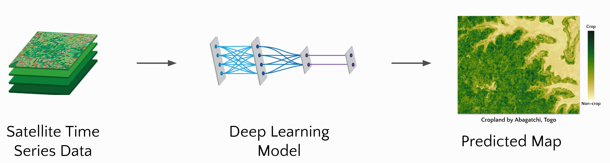
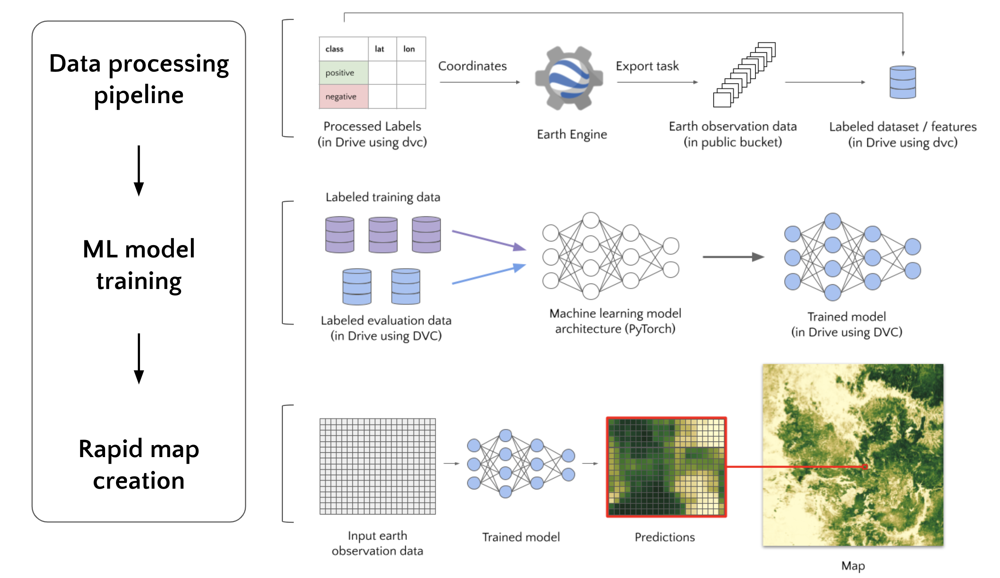

[ta1]: https://github.com/nasaharvest/openmapflow/actions/workflows/crop-mask-example-test.yaml
[tb1]: https://github.com/nasaharvest/openmapflow/actions/workflows/crop-mask-example-test.yaml/badge.svg
[da1]: https://github.com/nasaharvest/openmapflow/actions/workflows/crop-mask-example-deploy.yaml
[db1]: https://github.com/nasaharvest/openmapflow/actions/workflows/crop-mask-example-deploy.yaml/badge.svg

[ta2]: https://github.com/nasaharvest/openmapflow/actions/workflows/buildings-example-test.yaml
[tb2]: https://github.com/nasaharvest/openmapflow/actions/workflows/buildings-example-test.yaml/badge.svg
[da2]: https://github.com/nasaharvest/openmapflow/actions/workflows/buildings-example-deploy.yaml
[db2]: https://github.com/nasaharvest/openmapflow/actions/workflows/buildings-example-deploy.yaml/badge.svg

[ta3]: https://github.com/nasaharvest/openmapflow/actions/workflows/maize-example-test.yaml
[tb3]: https://github.com/nasaharvest/openmapflow/actions/workflows/maize-example-test.yaml/badge.svg
[da3]: https://github.com/nasaharvest/openmapflow/actions/workflows/maize-example-deploy.yaml
[db3]: https://github.com/nasaharvest/openmapflow/actions/workflows/maize-example-deploy.yaml/badge.svg

# OpenMapFlow 🌍
[](https://github.com/nasaharvest/openmapflow/actions/workflows/ci.yaml)
[![tb1]][ta1] [![db1]][da1]
[![tb2]][ta2] [![db2]][da2]
[![tb3]][ta3] [![db3]][da3]


Rapid map creation with machine learning and earth observation data.

[cb]: https://colab.research.google.com/assets/colab-badge.svg



**Example projects:** [Cropland](https://github.com/nasaharvest/openmapflow/tree/main/crop-mask-example), [Buildings](https://github.com/nasaharvest/openmapflow/tree/main/buildings-example), [Maize](https://github.com/nasaharvest/openmapflow/tree/main/maize-example)

**Example maps:** [Earth Engine script](https://code.earthengine.google.com/5671905780e2707ab3627d63b20ca9bc)


* [Tutorial](#tutorial-)
* [Creating a map from scratch](#creating-a-map-from-scratch)
    * [Generating a project](#generating-a-project-)
    * [Adding data](#adding-data)
    * [Training a model](#training-a-model-)
    * [Creating a map](#creating-a-map-)
* [Accessing existing datasets](#accessing-existing-datasets)

# Tutorial [![cb]](https://colab.research.google.com/github/nasaharvest/openmapflow/blob/main/openmapflow/notebooks/tutorial.ipynb)
Colab notebook tutorial demonstrating data exploration, model training, and inference over small region. ([video](https://youtu.be/UHEUB4RSAi4))

**Prerequisites:**
- Github access token (obtained [here](https://docs.github.com/en/authentication/keeping-your-account-and-data-secure/creating-a-personal-access-token))
- [Forked OpenMapFlow repository](https://github.com/nasaharvest/openmapflow/fork)
- Basic Python knowledge 

# Creating a map from scratch 

To create your own maps with OpenMapFlow, you need to 
1. [Generate your own OpenMapFlow project](#generating-a-project-), this will allow you to:
1. [Add your own labeled data](#adding-data-)
2. [Train a model](#training-a-model-) using that labeled data, and 
3. [Create a map](#creating-a-map-) using the trained model.



## Generating a project [![cb]](https://colab.research.google.com/github/nasaharvest/openmapflow/blob/main/openmapflow/notebooks/generate_project.ipynb)

A project can be generated by either following the below documentation OR running the above Colab notebook.

**Prerequisites:**
- [ ] [Github repository](https://docs.github.com/en/get-started/quickstart/create-a-repo) - where your project will be stored
- [ ] [Google/Gmail based account](https://www.google.com/account/about/) - for accessing Google Drive and Google Cloud
- [ ] Google Cloud Project ([create](https://console.cloud.google.com/projectcreate)) - for accessing Cloud resources for creating a map ([additional info](https://cloud.google.com/resource-manager/docs/creating-managing-projects#console))
- [ ] Google Cloud Service Account Key ([generate](
https://cloud.google.com/iam/docs/creating-managing-service-account-keys#iam-service-account-keys-create-console)) - for deploying Cloud resources from Github Actions

Once all prerequisites are satisfied, inside your Github repository run:
```bash
pip install openmapflow
openmapflow generate
```
The command will prompt for project configuration such as project name and Google Cloud Project ID. Several prompts will have defaults shown in square brackets. These will be used if nothing is entered. 

After all configuration is set, the following project structure will be generated:

```
<YOUR PROJECT NAME>
│   README.md
│   datasets.py             # Dataset definitions (how labels should be processed)
│   evaluate.py             # Template script for evaluating a model
│   openmapflow.yaml        # Project configuration file
│   train.py                # Template script for training a model
│   
└─── .dvc/                  # https://dvc.org/doc/user-guide/what-is-dvc
│       
└─── .github
│   │
│   └─── workflows          # Github actions
│       │   deploy.yaml     # Automated Google Cloud deployment of trained models
│       │   test.yaml       # Automated integration tests of labeled data
│       
└─── data
    │   raw_labels/                     # User added labels
    │   datasets/                       # ML ready datasets (labels + earth observation data)
    │   models/                         # Models trained using datasets
    |   raw_labels.dvc                  # Reference to a version of raw_labels/
    |   datasets.dvc                    # Reference to a version of datasets/
    │   models.dvc                      # Reference to a version of models/
    
```

**Github Actions Secrets**
Being able to pull and deploy data inside Github Actions requires access to Google Cloud. To allow the Github action to access Google Cloud, add a new repository secret ([instructions](https://docs.github.com/en/actions/security-guides/encrypted-secrets#creating-encrypted-secrets-for-a-repository)). 
- In step 5 of the instructions, name the secret: `GCP_SA_KEY`
- In step 6, enter your Google Cloud Service Account Key

After this the Github actions should successfully run.

**GCloud Bucket**:
A Google Cloud bucket must be created for the labeled earth observation files. Assuming gcloud is installed run:
```bash
gcloud auth login
gsutil mb -l <YOUR_OPENMAPFLOW_YAML_GCLOUD_LOCATION> gs://<YOUR_OPENMAPFLOW_YAML_BUCKET_LABELED_EO>
```

## Adding data

### Adding already existing data
**Prerequisites:**
- [ ] [Generated OpenMapFlow project](#generating-a-project-)

Add reference to already existing dataset in your datasets.py:
```python
from openmapflow.datasets import GeowikiLandcover2017, TogoCrop2019

datasets = [GeowikiLandcover2017(), TogoCrop2019()]
```
Download and push datasets
```bash
openmapflow create-datasets # Download datasets
dvc commit && dvc push      # Push data to version control

git add .
git commit -m'Created new dataset'
git push
```

### Adding custom data [![cb]](https://colab.research.google.com/github/nasaharvest/openmapflow/blob/main/openmapflow/notebooks/new_data.ipynb)

Data can be added by either following the below documentation OR running the above Colab notebook.

**Prerequisites:**
- [ ] [Generated OpenMapFlow project](#generating-a-project-)
- [ ] [EarthEngine account](https://earthengine.google.com/signup) - for accessing Earth Engine and pulling satellite data
- [ ] Raw labels - a file (csv/shp/zip/txt) containing a list of labels and their coordinates (latitude, longitude)

1. Move raw label files into project's data/raw_labels folder
2. Convert raw labels to standardized dataframe using the `LabeledDataset` class in datasets.py, example:
```python
label_col = "is_crop"

class TogoCrop2019(LabeledDataset):
    def load_labels(self) -> pd.DataFrame:
        # Read in raw label file
        df = pd.read_csv(PROJECT_ROOT / DataPaths.RAW_LABELS / "Togo_2019.csv")

        # Rename coordinate columns to be used for getting Earth observation data
        df.rename(columns={"latitude": LAT, "longitude": LON}, inplace=True)

        # Set start and end date for Earth observation data
        df[START], df[END] = date(2019, 1, 1), date(2020, 12, 31)

        # Set consistent label column
        df[label_col] = df["crop"].astype(float)

        # Split labels into train, validation, and test sets
        df[SUBSET] = train_val_test_split(index=df.index, val=0.2, test=0.2)

        # Set country column for later analysis
        df[COUNTRY] = "Togo"

        return df

datasets: List[LabeledDataset] = [TogoCrop2019(), ...]
```
Run dataset creation:
```bash
earthengine authenticate    # For getting new earth observation data
gcloud auth login           # For getting cached earth observation data

openmapflow create-datasets # Initiatiates or checks progress of dataset creation

dvc commit && dvc push      # Push new data to data version control

git add .
git commit -m'Created new dataset'
git push
```


## Training a model [![cb]](https://colab.research.google.com/github/nasaharvest/openmapflow/blob/main/openmapflow/notebooks/train.ipynb)

A model can be trained by either following the below documentation OR running the above Colab notebook.

**Prerequisites:**
- [ ] [Generated OpenMapFlow project](#generating-a-project-)
- [ ] [Added labeled data](#adding-data-)

```bash
# Pull in latest data
dvc pull

# Set model name, train model, record test metrics
export MODEL_NAME=<YOUR MODEL NAME>              
python train.py --model_name $MODEL_NAME    
python evaluate.py --model_name $MODEL_NAME 

# Push new models to data version control
dvc commit 
dvc push  

# Make a Pull Request to the repository
git checkout -b"$MODEL_NAME"
git add .
git commit -m "$MODEL_NAME"
git push --set-upstream origin "$MODEL_NAME"
```

Now after merging the pull request, the model will be deployed to Google Cloud.

## Creating a map [![cb]](https://colab.research.google.com/github/nasaharvest/openmapflow/blob/main/openmapflow/notebooks/create_map.ipynb)
**Prerequisites:**
- [ ] [Generated OpenMapFlow project](#generating-a-project-)
- [ ] [Added labeled data](#adding-data-)
- [ ] [Trained model](#training-a-model-)

Only available through above Colab notebook. Cloud Architecture must be deployed using the deploy.yaml Github Action.

# Accessing existing datasets
```python
from openmapflow.datasets import TogoCrop2019
df = TogoCrop2019().load_df(to_np=True)
x = df.iloc[0]["eo_data"]
y = df.iloc[0]["class_prob"]
```
